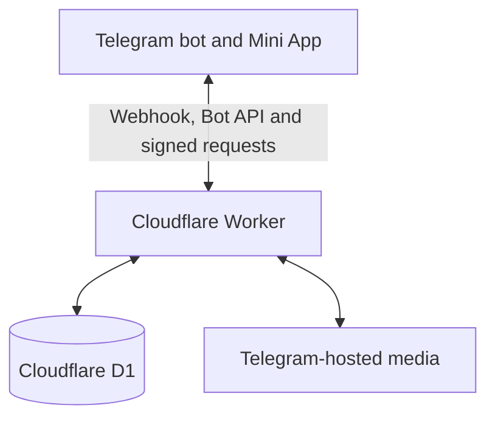

# XEvents

**Open-source event management inside Telegram.**

Create events, invite guests, collect RSVPs, issue tickets, check guests in with optional QR codes, accept payments, and share event media without leaving Telegram.

[](LICENSE) [](https://t.me/XEvents_bot) [](docs/architecture.md) [](package.json)

**[Try XEvents on Telegram →](https://t.me/XEvents_bot)**

[Screenshots / demo](#see-xevents-in-action) · [Features](#features) · [Self-hosting](#run-xevents-yourself) · [Contributing](CONTRIBUTING.md)

## See XEvents in action

Open **[@XEvents_bot](https://t.me/XEvents_bot)**, press **Start**, then choose **App**. Set your timezone in **Profile** and create your first event.

Product screenshots are not checked in yet. The [screenshot capture guide](docs/screenshots/README.md) lists four real screens to capture: Home / Explore, Create event, a personal RSVP invitation, and a ticket with QR check-in.

## Why XEvents?

- **Meet people where they already are.** Hosts and guests use Telegram; there is no separate app to install.
- **Choose how people join.** Share a ticket booking link or send personal invitations from a named guest list.
- **Keep attendance clear.** Track replies and group sizes, issue tickets, and check guests in by code or optional QR scan.
- **Control what guests see.** Make events private and restrict guest lists, media, locations, and joining details.
- **Keep the memories together.** Collect event photos, videos, and files in a shared gallery.
- **Host it yourself.** MIT-licensed JavaScript, a plain HTML/CSS Mini App, Cloudflare Workers, and D1.

## Features

| Area | What XEvents supports |
| --- | --- |
| **Events** | Banners, custom invitation messages, local timezones, duration or finish time, reminders, and public discovery by saved timezone. |
| **Invitations & RSVP** | Named guest links with Accept, Reject, Maybe, and Respond later; optional group counts; response deadlines; one-time links; one co-host per event. |
| **Tickets & check-in** | Shared booking links, optional organiser approval, unique ticket codes, optional QR codes, group check-in, and guest check-in notifications. |
| **Payments** | Free events, text prices with organiser-verified bank transfers or external payment links, and Telegram Stars. Stars payouts to organisers are manual. |
| **Media** | Photos, videos, and files; previews; Save and Send to Telegram; optional media-only upload links. |
| **Privacy** | Guest-list and media permissions; phone numbers and comments off by default; private locations released after the required response, approval, and payment. |
| **Hosting** | A Worker serves the bot webhook, Mini App, and API. D1 stores records; Telegram hosts uploaded media. |

[Full feature guide and examples](docs/features.md) · [Invitations and guest counts](docs/invitations.md) · [Payments and refunds](docs/payments.md)

### Two ways to invite

**Ticket booking:** share one link. Guests enter a ticket name and book or request a place. Enable individual approval when you need to review requests before releasing tickets and private locations. This mode has no RSVP choices.

**Named invitations:** enter a guest list and send each person their own RSVP link. Their name is already filled in. Set group sizes with simple list syntax:

| Guest-list entry | Meaning |
| --- | --- |
| `Alex = ?` | Ask how many people are coming. |
| `Sam = 2!` | Ask Sam to confirm two places. |
| `Taylor = 2` | Reserve two; allow Change number. |
| `Casey` | One person. |

Counts include the guest and range from 1 to 10. Named invitations save RSVPs directly and do not require organiser approval. See the [invitation guide](docs/invitations.md) for one-time links, deadlines, and co-host permissions.

## Run XEvents yourself

You need **Node.js 22+**, npm, your own [Telegram bot](https://t.me/BotFather), and a Cloudflare account with Workers and D1.

1. **Clone and install.**

   ```sh
   git clone https://github.com/ehsan0921/XEvents.git
   cd XEvents
   npm ci
   ```

2. **Create a development bot** with BotFather. Keep its token private and use a different bot from production.
3. **Configure local secrets.** Copy `.dev.vars.example` to `.dev.vars`, then fill in your development token and webhook secret. `SUPER_ADMIN_ID` is optional; blank disables the admin panel.

   ```sh
   cp .dev.vars.example .dev.vars
   ```

4. **Prepare local D1 storage.**

   ```sh
   npx wrangler d1 migrations apply xevents --local
   ```

5. **Run the Worker and Mini App locally.**

   ```sh
   npx wrangler dev
   ```

   Open `/app` on the local address Wrangler prints. Private data needs signed Telegram identity; an ordinary browser preview cannot sign you in. Follow the [Telegram testing instructions](docs/self-hosting.md#run-the-worker-locally) for a complete flow.

6. **Check the project.** `npm test` runs the Node.js suite; `npm run test:worker` builds the Worker and runs local integration checks with mocked Telegram requests.
7. **Deploy your instance.** The [self-hosting guide](docs/self-hosting.md) covers Cloudflare login, D1 creation, your own ignored production configuration, server-side secrets, remote migrations, deployment, and authenticated webhook setup.

`npm start` runs a separate polling bot with JSON-file storage, rather than the hosted Mini App. It removes that bot's webhook on startup. See [standalone bot development](docs/self-hosting.md#standalone-polling-bot) before using it.

## How it fits together



The Worker serves the Mini App and verifies Telegram identity. D1 holds events, guest responses, preferences, and queued messages. Telegram holds the uploaded files. Read the [architecture guide](docs/architecture.md) for the code map, delivery model, and scaling limits.

## Free software, practical limits

XEvents is free event management software you can use, modify, and self-host under MIT, including for commercial projects. It is designed for sports clubs, meetups, parties, workshops, and community activities.

There is no built-in event media count quota, but **unlimited free storage or hosting is not guaranteed**. Telegram restrictions and Cloudflare quotas still apply. Mini App downloads currently support files up to 20 MB; use **Send to Telegram** for larger files. Media is not an independent backup.

Direct card processing, automatic organiser payouts, and calendar synchronisation are not implemented. See [hosting and storage limits](docs/architecture.md#operational-constraints) and the [payment guide](docs/payments.md) before planning a deployment.

## Documentation

| Guide | Start here when you want to… |
| --- | --- |
| [Features and examples](docs/features.md) | Understand the app and choose a workflow for your community. |
| [Invitations](docs/invitations.md) | Set up RSVP lists, group counts, deadlines, privacy, or a co-host. |
| [Payments](docs/payments.md) | Configure paid events, payment review, Stars, or refunds. |
| [Self-hosting](docs/self-hosting.md) | Run your own bot, Mini App, and database. |
| [Architecture](docs/architecture.md) | Find the relevant code and understand deployment constraints. |
| [UX review](docs/UX-review.md) | Review expected user journeys and test boundaries. |

## Contributing and security

Bug reports, accessibility improvements, translations, and focused pull requests are welcome. Read [CONTRIBUTING.md](CONTRIBUTING.md) to get started.

Keep tokens, private deployment configuration, databases, and real guest data out of commits, issues, and screenshots. Report security concerns privately as described in [SECURITY.md](SECURITY.md).

## Licence

[MIT](LICENSE) · Copyright © 2026 XEvents contributors.

**[Plan your next event with XEvents on Telegram →](https://t.me/XEvents_bot)**
