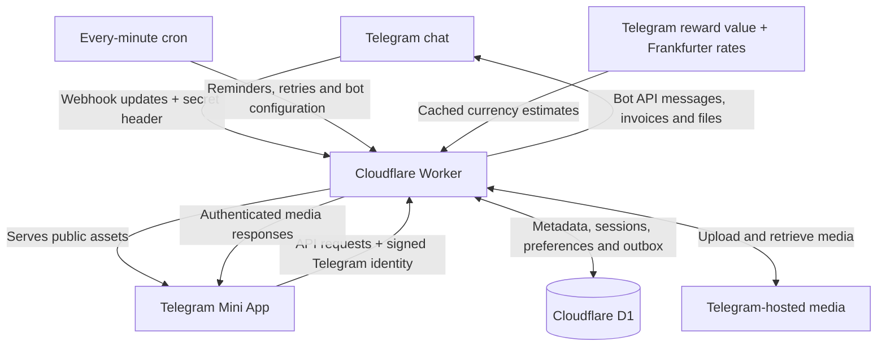

# Architecture

XEvents combines a Telegram bot and a browser-based Telegram Mini App. The full hosted application runs as one Cloudflare Worker with static assets and a D1 database. The frontend uses HTML, CSS and JavaScript modules; no separate frontend framework server or media bucket is required.

The Mini App assets are public; private API data requires Telegram authentication. Public event discovery means visibility to Mini App users, not a separate public event website.

## Source map

| Location | Responsibility |
| --- | --- |
| [`public/`](../public/) | Mobile interface, forms, navigation, error messages and shared media gallery. |
| [`src/worker.js`](../src/worker.js) | Asset routing, webhook authentication, setup, outgoing delivery and scheduled work. |
| [`src/mini-api.js`](../src/mini-api.js) | Authenticated event/profile API, management actions and role-specific projections. |
| [`src/mini-auth.js`](../src/mini-auth.js) | Verification of Telegram Mini App signed identity and its age. |
| [`src/bot.js`](../src/bot.js) | Button-driven conversations, invitations, responses, notifications and uploads. |
| [`src/worker-store.js`](../src/worker-store.js) | D1 write lease, state mutation, update deduplication and durable outgoing messages. |
| [`src/invitations.js`](../src/invitations.js), [`src/permissions.js`](../src/permissions.js), [`src/cohosts.js`](../src/cohosts.js) | Invitation claims, guest permissions and event-management roles. |
| [`src/tickets.js`](../src/tickets.js) | Optional QR images, ticket codes, current validity checks and check-in. |
| [`src/payments.js`](../src/payments.js), [`src/manual-payment.js`](../src/manual-payment.js), [`src/event-payment.js`](../src/event-payment.js) | Stars orders/refunds, organiser-verified payment records and event payment settings. |
| [`src/media-api.js`](../src/media-api.js), [`src/profile.js`](../src/profile.js) | Permission-checked media retrieval and Telegram-backed image uploads. |
| [`src/time.js`](../src/time.js), [`src/reminders.js`](../src/reminders.js) | Timezone-aware schedules and reminder eligibility. |
| [`src/exchange.js`](../src/exchange.js), [`src/pricing.js`](../src/pricing.js) | Online currency estimates and display settings. |
| [`migrations/`](../migrations/) | D1 tables and write-lease enforcement. |
| [`test/`](../test/), [`scripts/check-worker.mjs`](../scripts/check-worker.mjs) | Node tests and mocked Worker/D1 integration coverage. |

Production uses the Workers runtime with Node compatibility. Node.js 22 or newer is required for development tools, tests and the optional standalone polling process.

## Request and storage flow

Telegram delivers updates to `/telegram` with the configured secret header. Ordinary updates enter a state mutation; processed update IDs prevent committing the same update twice. Stars pre-checkout requests use a dedicated response path so Telegram receives its decision promptly.

The Mini App sends signed Telegram launch data with API requests. The server verifies its signature and age, then checks event ownership, co-host status or guest permissions. Hidden locations, private ticket details and management information are filtered on the server. `SUPER_ADMIN_ID` optionally enables an administrator view for one verified Telegram user; a client-provided role cannot enable it.

D1 stores JSON records for events, bot sessions, user profiles and preferences. Event records include guest responses, invitation state, schedules, media references and check-ins. Preferences also retain Stars orders and manual payment records, including records needed after event deletion. Supporting tables hold processed update IDs, write and delivery leases, the outgoing message queue and application settings.

A mutation obtains a shared write lease, loads event/session/preference records, applies the action, and batches changed records and outgoing Bot API calls together. The outbox is delivered afterwards, including from scheduled retries. A separate delivery lease prevents concurrent queue drains. This makes committed notifications durable, but does not guarantee exactly-once message delivery: a retry after an uncertain network result can duplicate a message.

## Media storage

Telegram hosts photos, videos, documents, event banners and profile images. D1 stores their file IDs, captions and related metadata. The Worker proxies permitted media requests so bot-token-bearing Telegram file URLs are not exposed to clients. Guests can explicitly save media or send a copy to their Telegram chat.

There is no application-level media item-count quota or R2 bucket. Provider restrictions and the growing D1 metadata still limit practical capacity. The Mini App refuses full-file retrieval above 20 MB and offers **Send to Telegram**; supported thumbnails can still be retrieved. Banner and profile uploads accept JPG, PNG or WebP up to 5 MB. Telegram media references are not an independent backup or a promise of unlimited free storage.

## Scheduled work

The configured cron runs every minute. It prepares eligible reminders, retries outgoing messages, maintains the Telegram **App** menu and webhook configuration, and removes processed update IDs older than seven days. Default reminders wait for confirmed acceptance, including any required approval and payment, and record the event start time already notified.

Currency estimates use Telegram's published organiser reward value and Frankfurter exchange rates. Successful snapshots refresh after six hours; failures retry later and recent cached data can be used for up to seven days. Estimates describe organiser rewards, not the price guests pay to buy Stars. Missing rates do not block event creation or Stars checkout.

## Roles and payment boundaries

An event has one owner and can have one active co-host. Co-hosts manage event details, guest responses, media and check-in, including access to guest information needed for management. The owner retains payment configuration, payment confirmation/refunds, co-host access, cancellation and deletion. Revoking co-host access does not erase that person's separate guest response or valid ticket.

Stars invoices use `XTR`; successful Telegram payment updates confirm purchases. Manual bank-transfer and external-link payments require the owner to verify receipt. Reporting a payment does not unlock a ticket. Stars receipts go to the bot's balance; organiser payouts are manual. The project has no direct card processor, split payments or automatic organiser payouts.

## Operational constraints

- **Designed for small communities.** Mutations load all event, session and preference records and serialise writes through one lease. Event media and responses grow inside JSON records. There is no published scalability benchmark or unbounded-capacity guarantee.
- **Delivery is best effort.** The queue retries transient failures; Telegram rejections and blocked bot chats can prevent a notification. Guests must interact with the bot before it can contact them privately. Unopened named invitations can appear in a host's planned list, but have no Telegram account to notify.
- **Provider limits and costs apply.** Workers requests, CPU, D1 size/operations and Telegram file restrictions remain relevant even without a built-in media-count quota. Review [Workers limits](https://developers.cloudflare.com/workers/platform/limits/), [D1 limits](https://developers.cloudflare.com/d1/platform/limits/) and the [Telegram Bot API](https://core.telegram.org/bots/api).
- **Link possession matters.** An invitation link is not proof of a person's real-world identity. Optional one-time invitations bind on a completed response; a co-host link grants management to its first valid claimant. Share private links carefully.
- **Disclosure cannot be reversed outside the app.** Revoked access cannot remove downloaded media, copied locations or messages already delivered to another chat.
- **Backups remain the host's responsibility.** Event deletion preserves payment records used for support; it does not erase all user history or copies held by Telegram recipients. There is no built-in complete account-erasure or media-backup workflow.
- **Some integrations are absent.** Calendar synchronisation, automatic organiser payouts and configurable Telegram test-server endpoints are not implemented.

## Standalone polling mode

[`src/main.js`](../src/main.js) runs a Node process for bot-only development. It deletes the bot's webhook, polls Telegram for updates and saves state through [`src/store.js`](../src/store.js) in a local `events.json` file. A lock prevents two processes from sharing that data directory.

This mode has no Worker HTTP API, hosted Mini App, D1 or scheduled Worker reminders. It does not share data with a hosted instance. Use a separate development bot; see [self-hosting](self-hosting.md#standalone-polling-bot).
